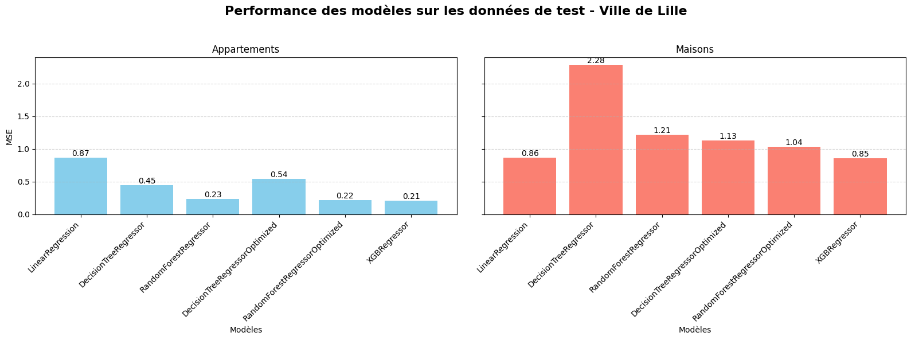
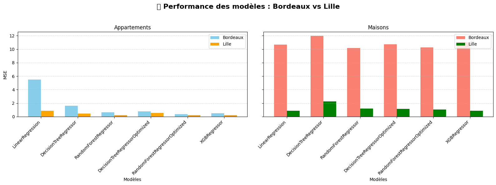
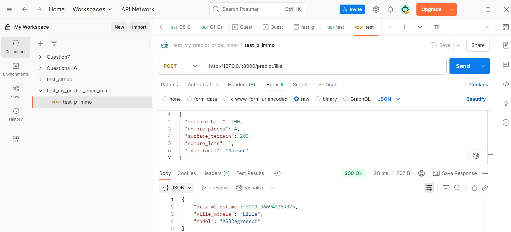
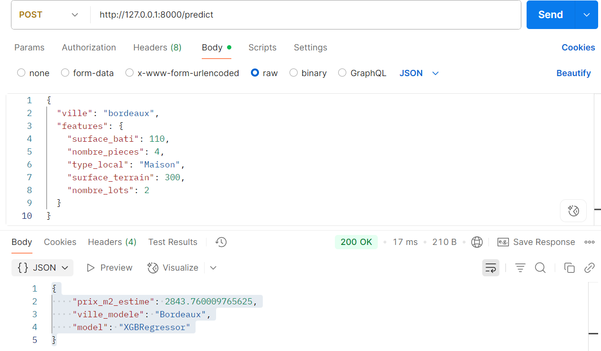
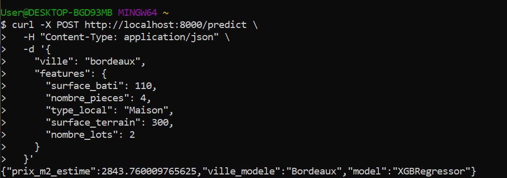
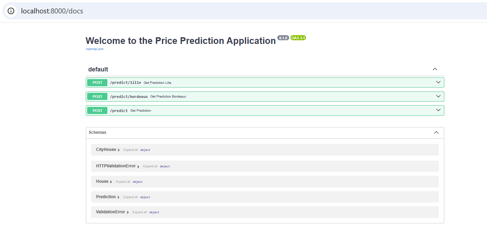

# Prédiction du prix au m² en immobilier en France

## Contexte

Une agence immobilière souhaite intégrer un outil d’estimation automatique du **prix au m²** dans ses applications internes. L’objectif est de mieux appuyer les décisions commerciales sur le marché immobilier des villes de **Lille** et **Bordeaux**, en s’appuyant sur les données publiques de transactions immobilières.

## Démarche 

### 🏗️ Phase 0 : Préparation des Données de valeur foncière (DVF) 
L'objectif de cette phase est de charger et de nettoyer les données DVF 2022 pour Lille et Bordeaux afin de préparer l'analyse, puis, 

Étapes :

- Chargement du fichier brut (format .txt, séparateur |)
- Filtrage : ventes à Lille ou Bordeaux avec surface bâtie et valeur foncière non nulles
- Conversion des valeurs en float
- Calcul du prix au m² (Valeur fonciere / Surface reelle bati)
- Export des jeux de données nettoyés dans data/lille_2022.csv et data/bordeaux_2022.csv

### 📊 Phase 1 — Modélisation du prix au m² à Lille (2022) pour les logements de 4 pièces

L'objectif est de construire un modèle de prédiction du prix au m² à Lille en 2022, pour les logements de 4 pièces, en distinguant appartements et maisons.

Étapes (notebook/phase_1_lille.ipynb):

- Chargement des données lille_2022.csv
- Filtrage : logements avec 4 pièces
- Séparation des jeux de données : 🏢 Appartements / 🏠 Maisons
- Sélection des variables pertinentes : [Surface reelle bati, Valeur fonciere, Nombre de lots, ...]
- Création de la cible : prix_m2 
- Nettoyage : suppression des valeurs manquantes et aberrantes
- Split train/test (80/20)
- Entraînement des modèles : LinearRegression, DecisionTreeRegressor, RandomForestRegressor
- Optimisation avec GridSearchCV
- Ajout d’un modèle avancé : XGBRegressor
- Évaluation via le MSE et comparaison des performances par type de bien




### 🧪 Phase 2 — Test de Généralisation sur Bordeaux
L'objectif est d'évaluer la capacité de généralisation des modèles entraînés sur Lille en les testant sur les logements 4 pièces vendus à Bordeaux en 2022.

Étapes (notebook/phase_2_bordeaux.ipynb):

- Charger les données de Bordeaux : data/bordeaux_2022.csv
- Appliquer les mêmes filtres que pour Lille (logements 4 pièces vendus en 2022)
- Séparer en deux sous-ensembles : Appartements et Maisons
- Prétraitement identique à Lille :
- Appliquer les modèles de Lille (⚠️ pas de réentraînement)
- Prédiction des prix_m2 sur Bordeaux
- Calcul des erreurs quadratiques moyennes (MSE)
- Comparer les performances entre Lille et Bordeaux :



### 🌐 Phase 3 — API REST d'estimation du prix au m² (FastAPI)
L'objectif est d'exposer les modèles prédictifs de Lille (Phase 1) et Bordeaux (Phase 2) via une API REST professionnelle et réutilisable utilisant FastAPI.

🚀 Fonctionnalités

- API construite avec FastAPI
- Deux modèles chargés (Lille & Bordeaux)
- 3 endpoints :
      /predict/lille — prédiction avec le modèle de Lille,
      /predict/bordeaux — prédiction avec le modèle de Bordeaux,
      /predict — sélection dynamique de la ville via le payload


🔧 Tests

L’API a été testée à l’aide de Postman et via des appels cURL, afin de valider la bonne exécution des prédictions pour chaque ville.







📝 Documentation interactive générée automatiquement avec Swagger UI, accessible à l’adresse /docs



## 📁 Structure projet

```
│
├── models/                           # Modèles sauvegardés (.pkl, .joblib)
│   └── model_lille.pkl
│
├── notebooks/                        # Études exploratoires et modélisation
│   ├── phase_1_lille.ipynb
│   └── phase_2_bordeaux.ipynb
│
├── api/                              # Code source de l’API FastAPI
│   ├── main.py                       # Point d’entrée FastAPI, 
│   ├── services.py                    # Fonctions de prédiction
│   ├── models.py                     # Chargement des modèles ML
│   ├── schemas.py                    # Modèles Pydantic pour validation des requêtes
│   └── routes.py                      # Routes des prédictions
│
├── tests/                            # Tests unitaires avec pytest
│   ├── test_predict_lille.py
│   └── test_predict_bordeaux.py
│
├── requirements.txt                  # Dépendances du projet
└── README.md                         # Documentation complète du projet

```


## 🔧 Installation du projet

### 1. Cloner le dépôt Git

```
git clone https://github.com/CSAADZIDI/Fast-api-ml-immo-project.git
cd Fast-api-ml-immo-project
```

### 2. Créer un environnement virtuel (optionnel mais recommandé)

```
python -m venv venv
source venv/bin/activate  # Sur Windows : venv\Scripts\activate
```

3. Installer les dépendances

```
pip install -r requirements.txt
```
4. 🚀 Lancer l'API FastAPI

Depuis le dossier racine du projet, exécutez :

```
uvicorn app.main:app --reload
```

L’API sera accessible à l’adresse :
👉 http://127.0.0.1:8000

La documentation interactive Swagger est disponible ici :
👉 http://127.0.0.1:8000/docs


Lancer les tests avec la commande:
```
pytest
```
Cela lancera tous les tests présents dans le dossier tests/.
